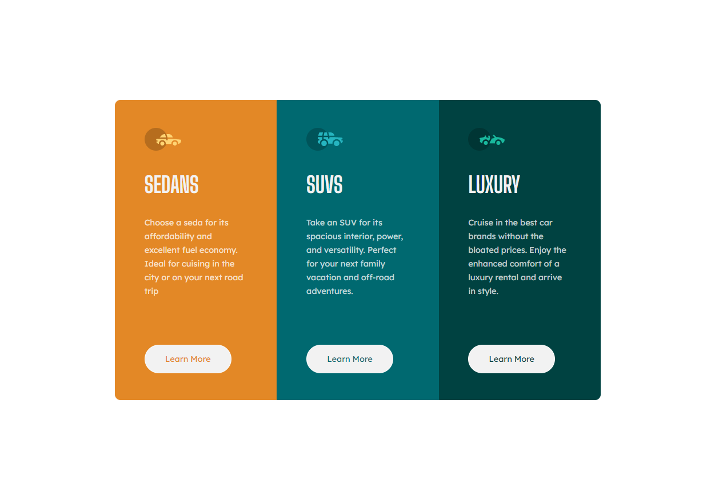

# Frontend Mentor - 3-column preview card component solution

This is a solution to the [3-column preview card component challenge on Frontend Mentor](https://www.frontendmentor.io/challenges/3column-preview-card-component-pH92eAR2-). Frontend Mentor challenges help you improve your coding skills by building realistic projects. 

## Table of contents

- [Overview](#overview)
  - [The challenge](#the-challenge)
  - [Screenshot](#screenshot)
  - [Links](#links)
- [My process](#my-process)
  - [Built with](#built-with)
  - [What I learned](#what-i-learned)
  - [Continued development](#continued-development)
- [Author](#author)
- [Acknowledgments](#acknowledgments)

**Note: Delete this note and update the table of contents based on what sections you keep.**

## Overview

### The challenge

Users should be able to:

- View the optimal layout depending on their device's screen size
- See hover states for interactive elements

### Screenshot




### Links

- Solution URL: [Add solution URL here](https://github.com/MarkosComK/front-end-mentor-solutions/tree/main/3-column-preview-card-component-main)
- Live Site URL: [Add live site URL here](https://markoscomk.github.io/front-end-mentor-solutions/3-column-preview-card-component-main/)

## My process

### Built with

- HTML5
- CSS custom properties
- SASS
- Flexbox
- Mobile-first workflow


### What I learned

I learned how to use SASS to better organize the code and improve its future modification. Improved use of html divs and tags and flexbox behavior.

Below is the format i used to organize the colors with SASS. This project is my first contact with this kind of use of CSS


```css
$orange: hsl(31, 77%, 52%);
$cyan: hsl(184, 100%, 22%);
$darkcyan2: hsl(179, 100%, 13%);
$white: hsla(0, 0%, 100%, 0.75);
$gray: hsl(0, 0%, 95%);
```


### Continued development

This front-end-mentor project may not be finished, but I will work on it until I complete it masterfully before moving on to another one.


## Author

- Frontend Mentor - [@MarkosComK](https://www.frontendmentor.io/profile/MarkosComK)
- Instagram - [@MarkosComK](https://www.instagram.com/markoscomk/)
- Twitter - [@MarkosComK](https://twitter.com/markoscomk)


## Acknowledgments

If you want to give me a tip (Anyone). Send me a mensage i'll be happy with your help, no matter how much you know about development. Feel free to talk with me in about whatever you want. 

## Last mensage

Everithing happens for a reason and this is there to help me [you].

<br>

<div>
  <a href="https://instagram.com/MarkosComK" target="_blank"></a>
  <a href="https://twitter.com/markoscomk" target="_blank"></a>
 <a href = "mailto:markoscomks@gmail.com"></a>
</div>

<br>