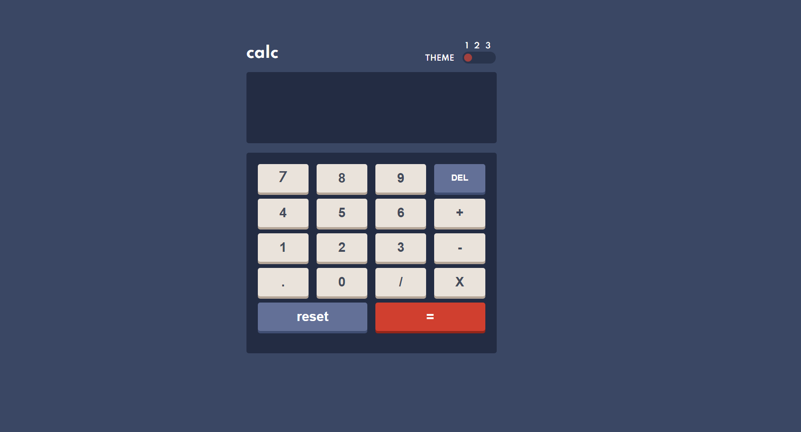

# Frontend Mentor - Calculator app solution

This is a solution to the [Calculator app challenge on Frontend Mentor](https://www.frontendmentor.io/challenges/calculator-app-9lteq5N29). Frontend Mentor challenges help you improve your coding skills by building realistic projects. 

## Table of contents

- [Overview](#overview)
  - [The challenge](#the-challenge)
  - [Screenshot](#screenshot)
  - [Links](#links)
- [My process](#my-process)
  - [Built with](#built-with)
  - [What I learned](#what-i-learned)
  - [Continued development](#continued-development)
  - [Useful resources](#useful-resources)
- [Author](#author)


**Note: Delete this note and update the table of contents based on what sections you keep.**

## Overview

### The challenge

Users should be able to:

- See the size of the elements adjust based on their device's screen size
- Perform mathmatical operations like addition, subtraction, multiplication, and division
- Adjust the color theme based on their preference
- **Bonus**: Have their initial theme preference checked using `prefers-color-scheme` and have any additional changes saved in the browser

### Screenshot




### Links

- Solution URL: [Click herel 👈](https://github.com/MarkosComK/front-end-mentor-solutions/tree/main/calculator-app-main)
- Live Site URL: [Click here 👈](https://markoscomk.github.io/front-end-mentor-solutions/calculator-app-main/)

## My process

### Built with

- Semantic HTML5 markup
- CSS custom properties
- JavaScript (ES6)
- SASS
- Flexbox
- CSS Grid
- Mobile-first workflow
- Figma


### What I learned

Well. Make an calculator it's more hard than i think. The logic behind a calculator it's really deep. I realy improve my JS a lot doing this. I also tried to do not use :root, and change all the themes using JS and CSS classes. 

Some snippets from how i've done this

```html
<body class="">body</h1>
```
```js
input.addEventListener('click', () => {
    let input = document.getElementById('myRange').value

    if (input === '2'){
        theme2()
    }
function theme2(){
    removeTheme3()
    body.classList.add('body2')
}
```

**This is just a thin part of the code.**


### Continued development

I'm still not satisfied with the calculator's mechanism, I think there's a lot my code can improve

### Useful resources

- [The input CSS style](https://codepen.io/markoscomk/pen/powOaXZ) - This helped me to add CSS to input range, but it seems like not work on every type of browsers


## Author

- Website - [Markos Vinicius](https://markoscomk.github.io/Portfolio) 💻
- Frontend Mentor - [@MarkosComk](https://www.frontendmentor.io/profile/markoscomk) 🖌
- Twitter - [@MarkosComK](https://www.twitter.com/MarkosComK) 🕊

 **Folow Me**

