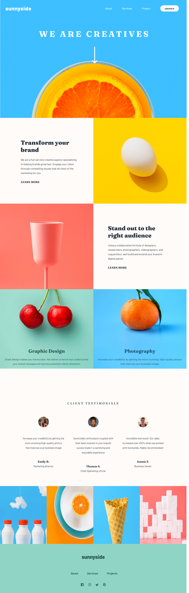

# Frontend Mentor - Sunnyside agency landing page solution

This is a solution to the [Sunnyside agency landing page challenge on Frontend Mentor](https://www.frontendmentor.io/challenges/sunnyside-agency-landing-page-7yVs3B6ef). Frontend Mentor challenges help you improve your coding skills by building realistic projects.

## Table of contents

- [Overview](#overview)
  - [The challenge](#the-challenge)
  - [Screenshot](#screenshot)
  - [Links](#links)
- [My process](#my-process)
  - [Built with](#built-with)
  - [What I learned](#what-i-learned)
  - [Continued development](#continued-development)
  - [Useful resources](#useful-resources)
- [Author](#author)
- [Acknowledgments](#acknowledgments)

**Note: Delete this note and update the table of contents based on what sections you keep.**

## Overview

### The challenge

Users should be able to:

- View the optimal layout for the site depending on their device's screen size
- See hover states for all interactive elements on the page

### Screenshot




### Links

- Solution URL: [Click here 👈](https://github.com/MarkosComK/front-end-mentor-solutions/tree/main/sunnyside-agency-landing-page-main)
- Live Site URL: [Click here 👈](https://markoscomk.github.io/front-end-mentor-solutions/sunnyside-agency-landing-page-main/)

## My process

### Built with

- Semantic HTML5 markup
- CSS custom properties
- Flexbox
- CSS Grid
- SASS
- Mobile-first workflow
- JavaScript


### What I learned

The most important part of this project for me it's the mobile navbar with an hamburguer menu; that's my first contact with JavaScript in a project and i think i do well. I'm proud of me. But i'm not too sure about the quality of my JS code, but i'm still workin on it.

Some code snippets from my navbar:

```html
  <nav>
      <div class="logo">sunnyside</div>
      <ul class="nav-links">
        <li><a class="navlink" href="#section1">About</a></li>
        <li><a class="navlink" href="#section3">Services</a></li>
        <li><a class="navlink" href="#section4">Project</a></li>
        <li><a class="navlink" href="#contact"><span>Contact</span></a></li>
      </ul>
      
  </nav>
```


```js
/*quando clicar no .hamburguer mostrar o nav*/

const navShow = () => {
    const hamburguer = document.querySelector('.hamburguer')
    const nav = document.querySelector('.nav-links')

    hamburguer.addEventListener('click', () => {
        nav.classList.toggle('show-nav')
    })

    nav.addEventListener('click', () => {
        nav.classList.toggle('show-nav')
    })

}

navShow()

```


### Continued development

Depending on the date you're reading this, i'm still working on this project. I want to make a different navber with a better UX for mobile devices and make some animations at sides of the page for ultra-wide monitors (like a feature). I love interative pages, that's why i want to add more interactivety 

### Useful resources

- [hamburguer responsive navbar](https://codepen.io/markoscomk/pen/NWgYEer) - This is my own version of hamburguer navbar on codepen. Mabe help you to understand better about it.
- [Free icons](https://iconmonstr.com) - This is a cool website with a lot of free icons that you can incorporete to your projects for free. Really usefull.


## Author

- My Portfolio - [MarkosComK](https://markoscomk.github.io/Portfolio/)
- Frontend Mentor - [@MarkosComK](https://www.frontendmentor.io/profile/markoscomk)
- Twitter - [@MarkoComK](https://www.twitter.com/MarkosComK)
- Linkedin - [Markos Vinicius](https://www.linkedin.com/in/markos-soares/)


## Acknowledgments

The feedbacks from people on [Frontendmentor](https://www.frontendmentor.io/solutions) and in comunities from discord help me to do this project. 


"-Find you're capable it's the first step to actually being"
